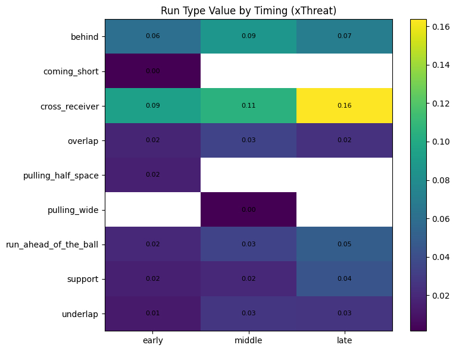
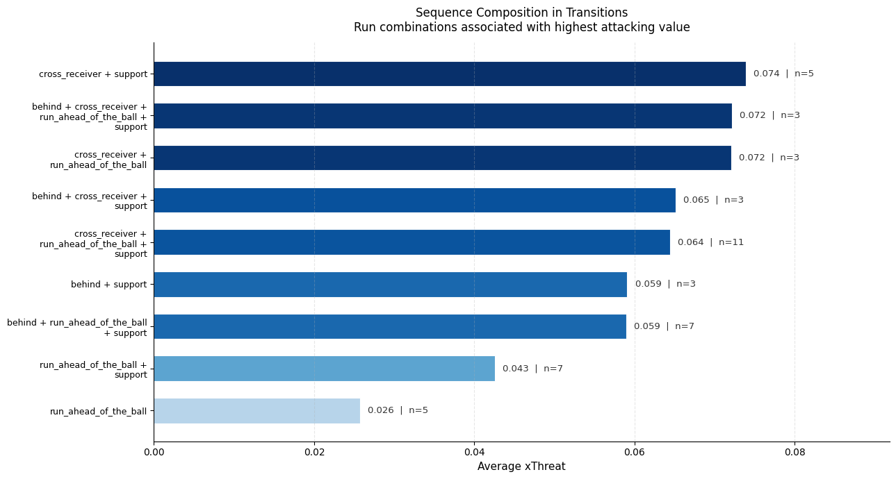
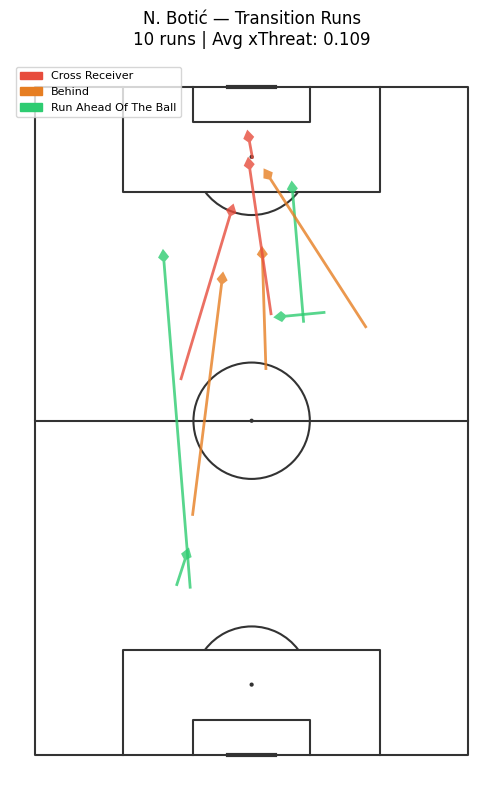

# Off-Ball Run Value in Transitions
### Context, Timing, Sequence and Physical Intensity

---

## What This Project Is About

Most football analysis looks at what players do with the ball. This project looks at what happens before that — the off-ball movement that creates the conditions for dangerous situations.

Specifically, it asks one question:

**What actually makes an off-ball run valuable in transitions?**

Not which run type is best on average — but under which conditions runs become dangerous, and how timing, combinations, and physical intensity shape that value.

This project is a direct response to feedback on a previous analysis, which raised two questions worth exploring further:

- Does xThreat's short evaluation horizon fairly capture all run types?
- Can we isolate context to give proper value to movements that look low-value in aggregate?

Both questions are addressed here.

---

## Data

- **Source:** SkillCorner Open Data
- **Competition:** A-League 2024/25
- **Matches:** 9 matches
- **Runs analysed:** 304 transition runs across 67 sequences
- **Variables used:** off-ball run events, xThreat, phase of play, sequence structure, pitch locations, and SkillCorner's own speed band classification

---

## Why Transitions?

The analysis focuses on transition and quick break phases rather than all phases of play.

Transitions are the moments where defensive structure is most disorganised and where off-ball movement has the most direct and immediate impact. They also align naturally with xThreat's short evaluation horizon — meaning the connection between movement and value is captured more reliably than in longer possession phases.

This was a deliberate choice — not a limitation.

---

## How It Works

The analysis is built in four layers, each adding a new dimension to the understanding of run value.

### 1. Context
Runs are filtered to transition and quick break phases. Within these phases, run types are compared to establish a baseline of value in the most dynamic attacking situations.

### 2. Sequence Timing
Runs are grouped into transition sequences and positioned within each sequence using relative order — early, middle, and late. This means timing reflects the structure of each individual attack rather than applying fixed time thresholds that may not fit all sequences.

Only sequences with at least 3 runs are included — any fewer and the early/middle/late split does not make sense.

### 3. Sequence Composition
Each sequence is represented by the set of run types present within it. Combinations are compared to identify which movement patterns are consistently associated with higher attacking value — moving from individual run analysis to collective movement patterns.

### 4. Physical Intensity
Using SkillCorner's own speed band classification, runs are grouped by intensity — running, high speed running, and sprinting — to test whether physical execution adds anything beyond what context and timing already explain.

---

## Key Findings

**The same run can mean very different things depending on context**

Support runs generate an average xThreat of 0.016 in the early phase but rise to 0.044 in the late phase. The movement is the same — the moment is not.

**Value builds as the transition develops**

Late-phase runs generate 0.092 xThreat on average compared to 0.028 for early runs — more than three times higher. Attacking threat is not created evenly throughout the transition. It builds.

**Combinations create more value than isolated runs**

Cross-receiver runs are consistently the most dangerous movement, increasing from 0.093 early to 0.164 in the late phase. But the real insight is in the combinations.

Run ahead of the ball alone generates around 0.026 xThreat. Combined with support, that rises to 0.043. Add a cross-receiver run and it reaches 0.064–0.074 — a 2–3x increase.

The most reliable high-value pattern in the dataset:

> **Cross-receiver + run ahead of the ball + support**
> Appears 11 times — average xThreat 0.064

**Faster runs generate more threat — but speed is not the whole story**

Sprinting runs generate 0.082 xThreat on average, almost double the value of standard running runs at 0.043. But the highest-value run types are also naturally faster movements. Speed amplifies value when everything else is already in place — it does not replace context or timing.

---

## Player Profiles

Three players are profiled to show how different movement strategies create value in transitions.

| Player | Runs | Avg xThreat | Shot Rate | Profile |
|--------|------|-------------|-----------|---------|
| G. May | 14 | 0.060 | 50% | High-volume hybrid |
| N. Botić | 10 | 0.109 | 80% | Pure finisher |
| J. Randall | 11 | 0.052 | 54.5% | Transition connector |

**N. Botić** does not need many runs — he needs the right ones. Behind runs generate his highest average xThreat at 0.212. His shot involvement rate of 80% is the highest of the three players. Nearly every run he makes connects to a genuine attacking outcome.

**G. May** contributes through consistent presence. Highest volume in the dataset, with value increasing steadily through the phases. His most dangerous contributions come from cross-receiver runs in the middle and late phases, and he regularly appears in the highest-value combinations.

**J. Randall** links the early and middle phases of the attack. He contributes across multiple run types without specialising in final actions — providing the structure that makes space for players like Botić to exploit.

These three profiles show that transition run value is not created in one way. Effective transitions involve all three types — a connector to build structure, a volume player to maintain options, and a finisher to exploit the moment.

---

## Limitations

- xThreat has a short evaluation horizon and may undervalue slower or deeper actions
- xThreat is based on ball location and does not account for defensive structure or pressure
- Sequences are defined using phase labels and frame gaps — a tactical regain-based definition would be more football-realistic
- Only 9 matches are available in the open dataset — findings are directional rather than definitive
- Sequence composition captures which run types co-occur but not their exact order or interaction
- Sprint runs represent only 11% of the sample — the physical layer finding should be treated as a signal, not a conclusion

---

## What Comes Next

The natural next steps for this work include:

- A larger dataset across multiple seasons or leagues
- Defensive context — pressure, shape, opponents bypassed
- Spatial relationships between simultaneous runs
- A sequence definition based on regain events rather than phase labels
- Distributions instead of averages to capture variance across run types

---

## Tools

- Python — pandas, matplotlib, mplsoccer
- SkillCorner Open Data
- Google Colab

---

## Part of a Series

This is the second project in a series exploring off-ball movement using SkillCorner open data.

**Project 1 — Off-Ball Movement and Attacking Threat**
Established that different run types generate different average xThreat values, with cross-receiver runs generating over 5x more threat than support runs in the A-League.
[View project](https://github.com/YIANNIS4/off-ball-movement-analysis)

**Project 2 — Off-Ball Run Value in Transitions (this project)**
Goes one layer deeper — asking not which runs are most valuable on average, but under which conditions runs become valuable, and how players create that value in real transition situations.

---

## Data Credit

Data provided by [SkillCorner](https://skillcorner.com) as part of their open data initiative.

Please credit SkillCorner if you use or build on this work.
